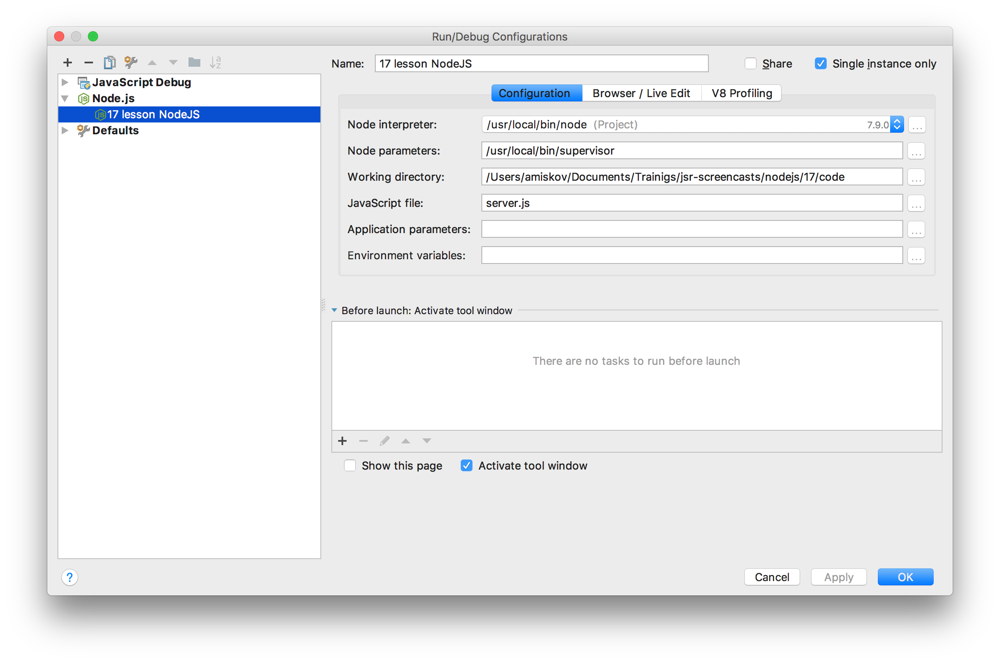

# Разработка, supervisor
## supervisor
Нода, считав файл, создает объект модуля и использует его. Поэтому при изменении файла с сервером нужно его перезапускать.

[`supervisor`](https://www.npmjs.com/package/supervisor) отслеживает изменения в директории и сам перезапускает Ноду. Ставится глобально. Запускать так:

```bash
supervisor server.js # вместо node server.js
```

Теперь при изменении `server.js` или других файлов из директории Нода будет автоматически перезапускать файл.

О чем нужно помнить:
* Вновь созданные файлы не обрабатываются. Нужен перезапуск или реквайр внось созданного файла куда-то в существующие.
* Если в папке, где запущен `supervisor` будут `node_modules`, то их он тоже будет смотреть. В том числе при установке новых модулей. Папку с модулями нужно или переместить выше или использовать параметр `--ignore`.


Настройка конфигурации WebStorm с `supervisor`:




