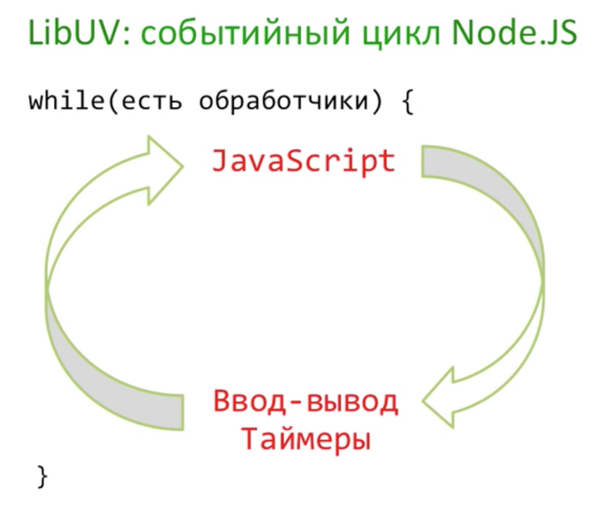

# Событийный цикл, библиотека libUV
`libUV` отвечает за кроссплатформенную реализацию функций работы с диском, сетью

LibUV так же поддерживает основной событийный цикл Ноды:

Event Loop Starvation (голодание событийного цикла) — когда Нода занята тяжелыми вычислениями и не успевает адекватно обрабатывать очередь в собитийном цикле.

Нода в основном используется там, где не нужны тяжелые вычилсения, а где нужно обрабатывать данные (бОльшая часть задач по веб-разработке).