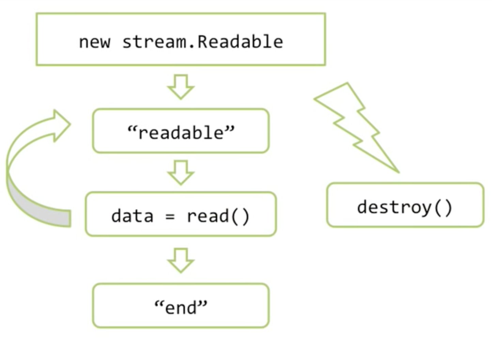
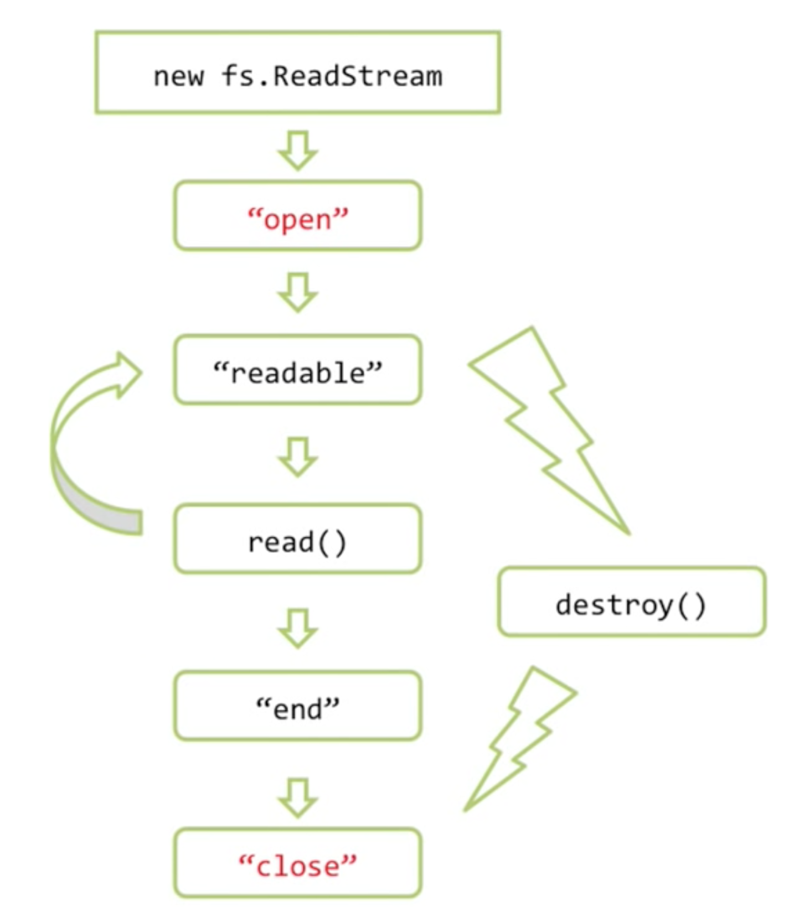

# Потоки данных в Node.JS, fs.ReadStream
Поток — универсальный способ работы с источниками данных.

`stream.Readable` — встроенный класс, реализует потоки для чтения. В основном используются его наследники:
* `fs.ReadStream` — для чтения файлов
* Первый аргумент `req` в `server.on('request', (req, res) => {})` тоже поток

`stream.Writable` — для записи. Так же используются наследники:
* `fs.WriteStream`
* `res` — второй аргумент в обработчике реквеста в сервере.

Есть и другие наследники.

Схема работы потока:



* Поток читает порцию данных (64Кб), срабатывает событие `readable`. Дальше поток не читает.
* Если на событие кто-то подписан, то он может считать эту порцию данных методом `stream.read()`.
* Как только данные прочитаны (вызван `read()`), буфер потока освобождатется и он может читать следующую порцию (опять 64Кб).
* ...

Поток — объект, который получает информацию о ресурсе (путь к файлу, например) и который умеет с этим ресурсом работать.

## Потоки `fs.ReadStream`

У разных наследников `stream.Readable` есть и свои фишки. Например, `fs.ReadStream` генерит дополнительные события (отмечены красным):



Если файл дочитан, то возникает событие `end`, а потом `close`. Если файл не дочитан (ошибка, например или вызван `stream.destroy()`), то `end` не сработает и будет сразу `close`.

## Преимущества
* Потоки эконопят память, считывают только порции и не идут дальше, если порции не обрабатываются.
* Универсальный интерфейс. Можно читать из файла или из любого другого ресурса. Обработчики могут быть одинаковыми.

## Обработка ошибок
Потоки наследуют от EventEmitter-а. Значит если будет ошибка, то весь процесс упадет. Нужно обязательно ее обрабатывать:

```js
stream.on('error', (err) => {
    if (err.code = 'ENOENT') {
        console.log(`Файл ${err.path} не найден.`);
    } else {
        console.error(err);
    }
});
```


